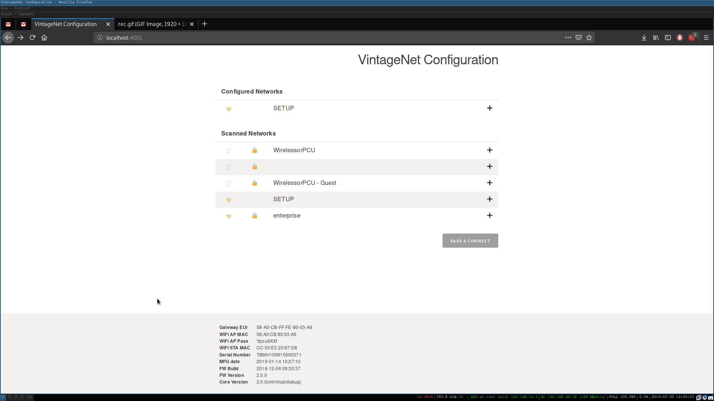

# VintageNet Configuration Wizard

Experimental Configuration utility for
[VintageNet](https://github.com/nerves-networking/vintage_net).

This library will create a WiFi access point and captive portal. Upon
connection, the user will be presented with a simple HTML form for
selecting and configuring available WiFi networks.

## Screenshots

