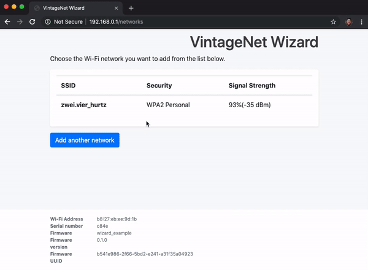

# VintageNet WiFi Configuration Wizard

[](https://circleci.com/gh/nerves-networking/vintage_net_wizard)
[](https://coveralls.io/github/nerves-networking/vintage_net_wizard?branch=master)
[](https://hex.pm/packages/vintage_net_wizard)

This is a WiFi configuration wizard that uses
[VintageNet](https://github.com/nerves-networking/vintage_net). It is intended
for use in Nerves-based devices that don't have a display for configuring WiFi.

Here's the intended use:

1. On device initialization, if WiFi hasn't been configured, configure WiFi to
   AP mode and start a webserver
2. A user connects to the access point and opens a web browser. The only
   website they can go to in the configuration utility.
3. The configuration utility shows a list of access points and the user can
   select one or more or enter information for a hidden access point
4. The user applies the configuration and the device stops AP mode and connects
   to the access point.

`VintageNet` persists WiFi configuration so the device will be able to connect
after reboots and power outages. To change the configuration later, a user needs
to take a device-specific action like hold down a button for 5 seconds. This
library has an example project for the Raspberry Pi for use as a demo.



## Features

* [x] - Simple web-based configuration utility
* [x] - WiFi scanning while in AP mode
* [x] - JSON REST-based API to support smartphone app-based configuration
* [x] - Captive portal detection
* [x] - WPA PSK configuration
* [ ] - WPA EAP configuration
* [x] - Hidden AP configuration
* [x] - Multiple AP selection (device tries access points in order until one
  works)
* [ ] - Custom styling and branding

## Supported WiFi adapters

Not all WiFi adapters support AP mode. Here are the ones that we've used:

1. Raspberry Pis with built-in WiFi modules (like the RPi 3, 4 and Zero W)
2. RT5370-based USB modules
3. Edimax EW-7612UAn V2 (See note)

It is highly likely that other modules work. We have not had any luck with
other Realtek RTL8192c (in the popular Edimax EW7811Un) or MediaTek MT7601u (in
lots of brands).

NOTE: For the Edimax EW-7612UAn V2 to work, you'll need to create a custom
Nerves system with `CONFIG_RTL8192CU=m` in the `linux-x.xx.defconfig` as well as
`BR2_PACKAGE_LINUX_FIRMWARE=y` and `BR2_PACKAGE_LINUX_FIRMWARE_RTL_81XX=y` in
`nerves_defconfig`.

## Configuration

It is expected that you're using
[`VintageNet`](https://github.com/nerves-networking/vintage_net) already. If
you're not, see that project first.

`VintageNetWizard` is an OTP application so it's mostly self-contained. Add it
to your `mix` dependencies like so:

```elixir
   {:vintage_net_wizard, "~> 0.4"}
```

The configuration wizard is not started by default to allow for more control
over business specific situations. You will need to add a call in your code
when you want the device placed into AP mode and the wizard started:

```elixir
defmodule MyApp do
  use Application

  def start(_type, _args) do
    if should_start_wizard?() do
      VintageNetWizard.run_wizard
    end
    # ...
    Supervisor.start_link(children, opts)
  end
end
```

This will be sufficient to try it out on a device that hasn't been configured
yet. You will want to add a mechanism for forcing the wizard the run WiFi
configuration again, such as holding a button for 5+ seconds. Take a look at
[Running the example](#running-the-example) section for steps on setting up
a button and running a quick example firmware on a device.

### UI Customization

`VintageNetWizard` allows you to add customization to the UI. The three UI
items that can be customized are: `:title`, `:title_color`, and
`:button_color`.

```elixir
VintageNetWizard.run_wizard(
  ui: [title: "My WiFi Wizard", title_color: "red", button_color: "#F0F0AD"]
)
```

Each configuration option is optional and will fall back to
`VintageNetWizard`s default colors and title.

### DNS in AP-mode

When the wizard is running, users go to either `http://192.168.0.1/` or
`http://wifi.config/` to access the web user interface. The latter can be
changed via the `config.exs`:

```elixir
config :vintage_net_wizard,
  dns_name: "my-wifi-config.com"
```

### Port

`VintageNetWizard` starts a webserver on port `80` by default. If port `80` is
not available on your device or you would prefer a different port, add the
following to your `config.exs`:

```elixir
config :vintage_net_wizard,
  port: 4001
```

If SSL is enabled the default port is `443`.

### SSL

To use SSL with the web UI, you can pass SSL options to
`VintageNetWizard.run_wizard/1`:

```elixir
VintageNetWizard.run_wizard(ssl: [keyfile: "/path/to/key.pem", certfile: "/path/to/cert.pem"])
```

To see all available options see `Plug.SSL.configure/1` and Erlang's `:ssl`
module.

### Device Info

If you want to display extra data about the device in the footer of the UI you
can pass in a list of key-value pairs to `VintageNetWizard.run_wizard/1`:

```elixir
VintageNetWizard.run_wizard(device_info: [{"Serial number", "1234"}, {"Version", "0.1.0"}])
```

The first item in the key-value pair is display name of the info and the second
item will be the value of the item.

### Interface name

VintageNetWizard uses `"wlan0"` by default. If you have more than one wireless
LAN or the interface is called something else, pass the appropriate interface
name to `VintageNetWizard.run_wizard/1` to use it:

```elixir
VintageNetWizard.run_wizard(ifname: "wlan1")
```

### Backends

Backends control how `VintageNetWizard` configures the network. The default
backend changes the network configuration as you would expect. This can get in
the way of development and can be disabled by using the
`VintageNetWizard.Backend.Mock` backend:

```elixir
config :vintage_net_wizard,
  backend: VintageNetWizard.Backend.Mock
```

### Captive Portal

Captive portal is enabled by default. If using a port other than `80` then all
traffic on port `80` will be captured and redirected to the specified wizard
address in order to trigger the portal.

You can disable captive portal in your configuration:

```elixir
config :vintage_net_wizard, captive_portal: false
```

### Inactivity Timeout

After a set mount of time of inactivity the wizard will timeout and shut down
the server. This prevents a device using the wizard to infinitely be in AP mode.
The default timeout is 10 minutes, but can be configured:

```elixir
config :vintage_net_wizard,
  inactivity_timeout: <timeout in minutes>
```

## JSON API

It is possible to write a smartphone app to configure your device using an API
endpoint. Documentation for the API is in [json-api.md](json-api.md).

## Running the example

The example builds a Nerves firmware image for supported Nerves devices
 that demonstrates the wizard. The wizard will run on
the first boot and also after a button has been held down for 5 seconds.

For the button to work, you'll need to wire up a button to GPIO 17/pin 11 and
3v3/pin 1 on the Raspberry Pi's GPIO header. See the image below for the
location:

[](https://pinout.xyz/#)

If you don't have a button, you can use a jumper wire to temporarily connect 3v3
power to pin 11. If you have a Raspberry Pi hat with a button connected to a
different GPIO pin, you can specify with pin to use in your config:

```elixir
config :wizard_example, gpio_pin: 27
```

The next step is to build the firmware. Make sure that you've installed Nerves
and run the following:

```sh
cd example

# Set the target to rpi0, rpi3, or rpi4 depending on what you have
export MIX_TARGET=rpi3
mix deps.get
mix firmware

# Insert a MicroSD card or whatever media your board takes
mix burn
```

Place the MicroSD card in the Raspberry Pi and power it on. You should see a
WiFi access point appear with the SSID "nerves-1234" where "1234" are part of
the device's serial number. Connect to the access point and then point your web
browser at [http://wifi.config](http://wifi.config/) or
[http://192.168.0.1/](http://192.168.0.1/). If you've configured an SSL
certificate, it's possible to use `https`. You may also need to change the
`:dns_name` configuration to match the name on your SSL certificate.

The SSID defaults to the hostname of the device, and you can change the SSID via
the `config.exs`:

```elixir
config :vintage_net_wizard,
  ssid: "MY_SSID"
```

## Stop callback

If your application runs a webserver or has other functionality that is
incompatible with the wizard, you can use the `:on_exit` option to
`VintageNetWizard.run_wizard/1` to register a completion callback. The callback
has the form, `{module, function, args}`. Here's an example:

```elixir
defmodule MyApp do
  def start_wizard() do
    VintageNetWizard.run_wizard(
      on_exit: {__MODULE__, :handle_on_exit, []}
    )
  end

  def handle_on_exit() do
    Logger.info("VintageNetWizard stopped")
  end
end
```

## Development

It's possible to work on the wizard locally and without using Nerves or changing
the network settings of your development machine:

```sh
$ mix deps.get
$ iex -S mix

iex> VintageNetWizard.run_wizard

07:49:00.710 [info]  Go to http://localhost:4001/
:ok
```

Look in `lib/vintage_net_wizard/backend/mock.ex` if you need to change anything
for your testing.
